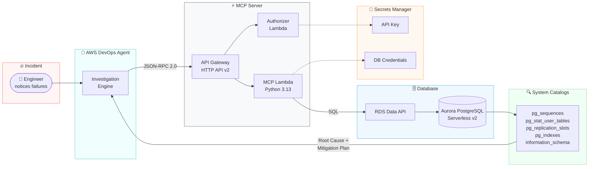
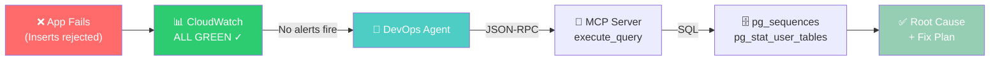

# Database Incident Investigation with AWS DevOps Agent

Automatically detect, investigate, and diagnose in-database failures on Amazon Aurora PostgreSQL using AWS DevOps Agent with custom MCP servers — where CloudWatch metrics stay green and only live SQL introspection reveals the root cause.

## Overview

When a database-backed application fails, on-call engineers check CloudWatch dashboards and find everything green. The real problem lives inside the database — in system catalogs, sequences, statistics, and replication state — invisible to traditional monitoring. This demo deploys an Aurora PostgreSQL cluster, wires it to AWS DevOps Agent via a custom MCP server, and lets you inject real database failures to watch the agent diagnose them automatically.

The MCP server bridges the gap between metric-based observability and in-database state, giving DevOps Agent the ability to run live SQL against PostgreSQL system catalogs during investigations.

## At a Glance

| | |
|---|---|
| **Duration** | ~15 min deployment + ~5 min per scenario |
| **Difficulty** | Intermediate |
| **Target Audience** | DBAs, SREs, DevOps Engineers, Solutions Architects |
| **Key Technologies** | Amazon Aurora PostgreSQL, AWS DevOps Agent, MCP (Model Context Protocol), Lambda, API Gateway, RDS Data API |
| **Estimated Cost** | ~$2–5/day while running (Serverless v2 at minimum ACU) |
| **AWS Regions** | us-east-1 (DevOps Agent supported region) |

## DevOps Agent Features Demonstrated

| Feature | How it's demonstrated |
|---------|----------------------|
| **On-demand Investigation** | Inject a DB fault → manually trigger investigation → agent diagnoses via MCP |
| **Custom MCP Server** | Purpose-built MCP server queries PostgreSQL system catalogs in real time |
| **Root Cause Analysis** | Agent identifies schema/catalog-level issues invisible to CloudWatch |
| **Mitigation Planning** | Agent produces step-by-step remediation with rollback plan |
| **Tool Orchestration** | Agent chains `list_clusters` → `describe_table` → `execute_query` to reach diagnosis |

## Why CloudWatch Isn't Enough

| CloudWatch / RDS metrics **CAN** see | **ONLY** the MCP server can reveal (via SQL) |
|---|---|
| CPU, memory, ACU capacity, IOPS | Schema & DDL — column types, indexes, constraints |
| Database connections count & limits | Sequence values and how close they are to overflow |
| Aggregate wait events, top SQL by load | Dead tuples, table/index bloat, last (auto)vacuum |
| Replica lag, deadlock counts | Logical replication slot state & retained WAL |
| That a query is slow (latency) | *Why* it is slow — EXPLAIN plan & stale statistics |

## Architecture



### Investigation Flow (Simplified)



**Flow:**
1. Engineer notices application INSERT failures
2. CloudWatch metrics are all green — no alerts fire
3. Engineer asks DevOps Agent to investigate
4. Agent calls MCP server tools (`list_clusters`, `execute_query`, etc.)
5. MCP Lambda queries PostgreSQL system catalogs via RDS Data API
6. Agent identifies root cause and produces mitigation plan

## Prerequisites

- AWS CLI v2 configured with credentials and default region
- An AWS account with permissions for CloudFormation, RDS, Lambda, API Gateway, IAM, Secrets Manager
- A VPC with at least 2 subnets in different AZs

## Quick Start

### 1. Clone the repository

```bash
git clone https://github.com/aws-samples/aws-devops-agent-databases.git
cd aws-devops-agent-databases
```

### 2. Deploy the Aurora PostgreSQL cluster

```bash
aws cloudformation create-stack \
  --stack-name aurora-postgres-cluster \
  --template-body file://cloudformation/aurora-postgresql-cluster.yaml \
  --parameters \
    ParameterKey=VpcId,ParameterValue=<your-vpc-id> \
    ParameterKey=SubnetId1,ParameterValue=<subnet-az1> \
    ParameterKey=SubnetId2,ParameterValue=<subnet-az2> \
  --capabilities CAPABILITY_NAMED_IAM \
  --region us-east-1

aws cloudformation wait stack-create-complete --stack-name aurora-postgres-cluster
```

### 3. Deploy the MCP server

```bash
aws cloudformation create-stack \
  --stack-name aurora-mcp-server \
  --template-body file://cloudformation/aurora-postgresql-mcp-server.yaml \
  --parameters \
    ParameterKey=Environment,ParameterValue=demo \
    ParameterKey=DBUsername,ParameterValue=postgres \
    ParameterKey=DBPassword,ParameterValue=Welcome1! \
    ParameterKey=AllowWriteQueries,ParameterValue=true \
  --capabilities CAPABILITY_NAMED_IAM \
  --region us-east-1

aws cloudformation wait stack-create-complete --stack-name aurora-mcp-server
```

### 4. Register with DevOps Agent

#### Prerequisites

Before starting, ensure you have:

- **Aurora PostgreSQL MCP server deployed** — the CloudFormation stack (`aurora-postgresql-mcp-server.yaml`) is successfully created
- **MCP Endpoint URL** — available in the stack outputs (e.g., `https://pv1b2tti50.execute-api.us-east-1.amazonaws.com/mcp`)
- **API Key** — stored in Secrets Manager at `/<environment>/postgres-mcp-server/api-key`
- **AWS DevOps Agent** — access to the DevOps Agent console in a supported region (us-east-1, us-west-2, ap-southeast-2, ap-northeast-1, eu-central-1, or eu-west-1)

#### Step 1: Retrieve the MCP Endpoint URL

**From CloudFormation Console:**

1. AWS Console → **CloudFormation**
2. Select your MCP server stack
3. Go to the **Outputs** tab
4. Copy the value of **McpEndpointUrl**

#### Step 2: Retrieve the API Key

**From Secrets Manager Console:**

1. AWS Console → **Secrets Manager**
2. Find the secret: `/<environment>/postgres-mcp-server/api-key`
3. Click on the secret name
4. Scroll to the **Secret value** section
5. Click **Retrieve secret value**
6. Copy the value of the `api_key` field

#### Step 3: Register the MCP Server (Account Level)

MCP servers are registered at the AWS account level and shared among all Agent Spaces.

**Via Console (Recommended):**

1. Sign in to the **AWS Management Console**
2. Navigate to the **AWS DevOps Agent** console
3. Go to **Capability Providers** (side navigation)
4. Find **MCP Server** in the Available providers section
5. Click **Register**
6. Leave **Enable Dynamic Client Registration** unchecked
7. Leave **Connect to endpoint using private connection** unchecked (unless your MCP server is on a private network)
8. Click **Next**

**Page 2: Authorization Flow**

Select **API Key**. Click **Next**.

**Page 3: Authorization Configuration**

| Field | Value |
|-------|-------|
| API Key Name | `Aurora-Postgres-MCP-Key` |
| API Key Header | `Authorization` |
| API Key Value | *(paste the value retrieved in Step 2)* |

Click **Next**.

**Page 4: Review and Submit**

1. Review all configuration details
2. Click **Submit**
3. AWS DevOps Agent will validate the connection to your MCP server
4. Wait for the status to show as registered/valid

Save the returned `serviceId` for the next steps.

#### Step 4: Create an Agent Space (if needed)

Skip this step if you want to add the MCP server to an existing Agent Space.

**Via Console:**

1. In the DevOps Agent console, click **Create Agent Space**
2. Enter a name (e.g., `Aurora-PostgreSQL-Space`)
3. Click **Create**

Save the returned `agentSpaceId`.

#### Step 5: Associate AWS Account with the Agent Space

This gives the Agent Space access to your AWS resources for investigation.

**Via Console:**

1. Select your Agent Space
2. Go to the **Capabilities** tab
3. Under **AWS Account**, click **Associate**
4. Select or create an IAM role with the necessary permissions
5. Enter your Account ID
6. Select account type: **monitor**

#### Step 6: Associate Event Channel (Optional)

Enables event-driven investigations (e.g., triggered by CloudWatch alarms).

#### Step 7: Add the MCP Server to the Agent Space

**Via Console:**

1. Select your Agent Space
2. Go to the **Capabilities** tab
3. In the **MCP Servers** section, click **Add**
4. Select `aurora-postgres-mcp-server`
5. Configure tool access — **Select specific tools** (recommended) and allowlist:
   - `list_clusters`
   - `list_databases`
   - `list_schemas`
   - `list_tables`
   - `describe_table`
   - `execute_query`
6. Or choose **Allow all tools**
7. Click **Add**

#### Step 8: Verify the Integration

**From the Console:**

1. Go to your Agent Space
2. Open the **Capabilities** tab
3. Confirm the MCP Server appears with status **Valid**

### 5. Setup the test schema

```bash
bash scripts/setup-schema.sh
```

### 6. Run a scenario

```bash
# Inject Scenario 1: Sequence Exhaustion
bash scripts/inject-scenario1.sh

# Then ask DevOps Agent:
# "Our orders service is failing on inserts with errors. All CloudWatch metrics
#  for cluster aurora-postgres-cluster-1 look normal. Can you investigate?"
```

Total deployment: ~15 minutes.

## Failure Scenarios

| # | Scenario | What breaks | What CloudWatch shows | Root cause location |
|---|----------|-------------|----------------------|---------------------|
| 1 | **Sequence Exhaustion** | All inserts fail | All green | `pg_sequence` / `pg_sequences` |
| 2 | **Table & Index Bloat** | Gradual latency increase | Gentle IOPS rise | `pg_stat_user_tables` (n_dead_tup) |
| 3 | **Missing Index / Stale Stats** | One query times out | Aggregate latency normal | `EXPLAIN`, `pg_indexes`, last_analyze |
| 4 | **Inactive Replication Slot** | Storage fills up | Free storage falling | `pg_replication_slots` (active) |

### Recommended demo order

1. **Start with Scenario 1** — most dramatic (complete write outage with green dashboards)
2. **Follow with Scenario 4** — most complex (cascading risk, WAL mechanics)

## Run the Demo

### 1. Verify the cluster is healthy

```bash
bash scripts/test-connection.sh
```

### 2. Inject a failure

```bash
bash scripts/inject-scenario1.sh
```

### 3. Show green dashboards

Open CloudWatch → RDS metrics for `aurora-postgres-cluster-1`. All metrics normal.

### 4. Ask DevOps Agent to investigate

> "Our orders service is failing on inserts with errors. All CloudWatch metrics for cluster aurora-postgres-cluster-1 look normal — CPU, connections, and IOPS are all green. Can you investigate what's wrong?"

### 5. Watch the diagnosis (~2–3 minutes)

The agent autonomously:
- Confirms cluster health via `list_clusters`
- Discovers the `orders` table via `list_tables` + `describe_table`
- Queries `pg_sequences` and finds `orders_id_seq` at 100% consumed
- Confirms `orders.id` is `integer` (int4, max 2,147,483,647)
- Delivers root cause + mitigation plan

### 6. Reset

```bash
bash scripts/reset-scenario1.sh
```

## Project Structure

```
├── README.md
├── CONTRIBUTING.md
├── LICENSE
├── cloudformation/
│   ├── aurora-postgresql-cluster.yaml       # Aurora PostgreSQL Serverless v2 cluster
│   ├── aurora-postgresql-mcp-server.yaml    # MCP server (Lambda + API Gateway)
│   └── devops-agent-integration.yaml        # DevOps Agent space + MCP registration
├── scripts/
│   ├── deploy-all.sh                        # One-command deployment
│   ├── setup-schema.sh                      # Create test tables and seed data
│   ├── test-connection.sh                   # Verify MCP server connectivity
│   ├── inject-scenario1.sh                  # Trigger: Sequence exhaustion
│   ├── inject-scenario2.sh                  # Trigger: Table bloat
│   ├── inject-scenario3.sh                  # Trigger: Missing index / stale stats
│   ├── inject-scenario4.sh                  # Trigger: Inactive replication slot
│   ├── reset-scenario1.sh                   # Reset scenario 1
│   ├── reset-all.sh                         # Reset all scenarios
│   └── cleanup.sh                           # Delete all resources
└── docs/
    ├── ARCHITECTURE.md                      # Full architecture documentation
    ├── DEVOPS_AGENT_INTEGRATION.md          # Step-by-step DevOps Agent registration
    ├── TROUBLESHOOTING_SCENARIOS.md         # Four failure scenarios (detailed)
    └── SCENARIO1_WALKTHROUGH.md             # Complete Scenario 1 demo with agent output
```

## MCP Server Tools

| Tool | Description | Arguments |
|------|-------------|-----------|
| `list_clusters` | List all Aurora PostgreSQL clusters | (none) |
| `list_databases` | List databases in a cluster | cluster_identifier, database |
| `list_schemas` | List schemas in a database | cluster_identifier, database |
| `list_tables` | List tables in a schema | cluster_identifier, database, schema_name |
| `describe_table` | Show column definitions | cluster_identifier, database, table_name |
| `execute_query` | Run a SQL query via Data API | cluster_identifier, database, sql |

## Cost Estimate

| Resource | Monthly (approx.) |
|----------|-------------------|
| Aurora Serverless v2 (0.5 ACU min) | ~$45 |
| Lambda (MCP + Authorizer) | < $1 |
| API Gateway | < $1 |
| Secrets Manager (2 secrets) | $0.80 |
| DevOps Agent (investigation hours) | ~$5 (demo usage) |
| **Total** | **~$2–5/day** |

**Cost optimization:** Tear down when not in use with `bash scripts/cleanup.sh`.

## Cleanup

```bash
bash scripts/cleanup.sh
```

Deletes all resources in reverse dependency order: DevOps Agent registration, MCP server stack, Aurora cluster stack, and any leftover secrets.

## Contributing

We welcome community contributions! Please see [CONTRIBUTING.md](CONTRIBUTING.md) for guidelines.

## Security

See [CONTRIBUTING](CONTRIBUTING.md#security-issue-notifications) for more information.

## License

This library is licensed under the MIT-0 License. See the [LICENSE](LICENSE) file.
